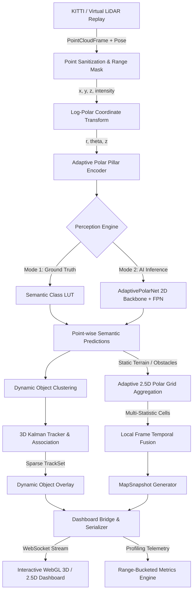

# Adaptive Variable-Resolution 2.5D LiDAR Mapping for Dynamic Environment Perception

[](https://www.python.org/)
[](https://pytorch.org/)
[](https://fastapi.tiangolo.com/)
[](LICENSE)
[](tests/)
[](http://www.semantic-kitti.org/)

An end-to-end, high-performance perception and spatial mapping framework for autonomous mobile robotics. The system substitutes high-overhead uniform Cartesian grids with a native **Tiered Log-Polar Range-Ring representation** directly derived from sensor range and azimuth, achieving a **~55× memory reduction (~98.2%)** while maintaining high spatial resolution in the critical near-field collision zone.

---

## 1. Overview

Processing 3D LiDAR point clouds (~125,000 points/frame at 10 Hz) for real-time mobile robot navigation presents severe computational and memory bottlenecks. Standard approaches rasterize points into uniform 2D/2.5D elevation grids (e.g., $5\text{ cm}$ resolution over $200\text{m} \times 200\text{m} = 16,000,000$ cells), consuming massive memory (~256 MB per map snapshot) and wasting compute on sparsely populated far-field regions.

This project implements a **native variable-resolution perception and mapping pipeline**:
1. **Polar Pillar Ingest**: Directly bins $(r, \theta, z, \text{intensity})$ points into $O(1)$ addressable tiered range rings.
2. **Deep Learning Perception**: Segments 20 semantic classes and classifies drivable vs. non-drivable vs. dynamic objects.
3. **Multi-Statistic 2.5D Mapping**: Retains terrain elevations, obstacle top heights, and overhangs without single-height z-buffer artifacts.
4. **Pose-Aware Temporal Fusion**: Anchors the persistent map to a translation-only local reference frame (absorbing vehicle yaw before binning).
5. **Dynamic Object Tracking**: Isolates moving vehicles and pedestrians using 3D Kalman filtering and Hungarian association, maintaining them in a sparse track overlay.
6. **Real-Time WebGL Dashboard**: Streams 3D point clouds, polar radar sweeps, dynamic bounding boxes, and memory telemetry via WebSockets at 30+ FPS.

---

## 2. Architecture & Data Flow



---

## 3. Key Features

- **Native Tiered Polar Representation ($O(1)$ Addressing)**: Direct calculation of tier, ring, and sector indices without tree traversals (Quadtree/Octree).
- **55× Memory Reduction**: Compresses the active cell space from **16,000,000 cells** (uniform 5cm grid) to **290,048 cells** (adaptive schedule) over a 200m diameter workspace.
- **Multi-Statistic Cells**: Encapsulates robust ground height (5th percentile), obstacle top height (95th percentile), majority semantic class, confidence, dynamic instance ID, and normalized point density.
- **Local Reference Frame Anchoring (ADR-1)**: Grid coordinates persist against translation-only recentering; ego vehicle rotation is absorbed before binning, eliminating yaw distortion.
- **3D Constant-Velocity Kalman Tracker (ADR-7)**: Velocity vector estimation ($\vec{v} = [v_x, v_y]$) and automated separation of moving vehicles from parked obstacles.
- **Virtual LiDAR Replay Engine**: Frame-by-frame simulation consuming raw SemanticKITTI `.bin`, `.label`, `calib.txt`, and poses.
- **Range-Bucketed Quantitative Evaluation**: Granular metrics computed across distance zones ($0-10\text{m}$, $10-25\text{m}$, $25-50\text{m}$, $50-100\text{m}$).
- **Interactive WebGL Dashboard**: Real-time 3D orbit viewer, concentric polar range ring radar canvas, live latency meters, and playback timeline scrubbing.

---

## 4. Adaptive Grid Schedule & Memory Comparison

| Tier | Range Interval $[r_{\min}, r_{\max})$ | Radial Step $\Delta r$ | Azimuth Sectors | Ring Count | Total Cells | Operational Zone Purpose |
|:---:|:---:|:---:|:---:|:---:|:---:|:---|
| **Tier 0** | $0.0 - 10.0\text{ m}$ | $0.05\text{ m}$ ($5\text{ cm}$) | 1024 | 200 | **204,800** | Near-field collision avoidance & precision manipulation |
| **Tier 1** | $10.0 - 25.0\text{ m}$ | $0.15\text{ m}$ ($15\text{ cm}$) | 512 | 100 | **51,200** | Immediate path planning & braking zone |
| **Tier 2** | $25.0 - 50.0\text{ m}$ | $0.30\text{ m}$ ($30\text{ cm}$) | 256 | 83 | **21,248** | Mid-range obstacle detection & tracking |
| **Tier 3** | $50.0 - 100.0\text{ m}$ | $0.50\text{ m}$ ($50\text{ cm}$) | 128 | 100 | **12,800** | Far-field horizon situational awareness |
| **Total** | **$0.0 - 100.0\text{ m}$** | — | — | **483** | **290,048** | **~55× Memory Reduction ($\approx 98.2\%$)** |

### Addressing Mathematics
For point $(x, y, z)$:
$$r = \sqrt{x^2 + y^2}, \quad \theta = \text{atan2}(y, x) \in [-\pi, \pi)$$
$$\text{tier} = \text{lookup\_tier}(r)$$
$$\text{ring} = \left\lfloor \frac{r - r_{\min}}{\Delta r} \right\rfloor, \quad \text{sector} = \left\lfloor \frac{(\theta + \pi) \cdot N_{\text{sectors}}}{2\pi} \right\rfloor$$

---

## 5. Tech Stack

- **Core Logic & Simulation**: Python 3.8+, NumPy, SciPy
- **Deep Learning Backbone**: PyTorch, Torchvision, CUDA (optional, automatic CPU fallback)
- **Web Backend & Streaming**: FastAPI, Uvicorn, WebSockets, asyncio
- **Frontend Dashboard**: HTML5 Canvas, WebGL, Vanilla CSS (Design Tokens, Glassmorphism, Responsive HUD)
- **Configuration & Schemas**: PyYAML, Typed Dataclasses
- **Experiment Logging & Testing**: TensorBoard, Pytest, psutil

---

## 6. Project Structure

```
.
├── configs/                     # Externalized YAML configuration files
│   ├── dataset.yaml             # Dataset paths, frame limits, range bounds
│   ├── classes.yaml             # Raw to 20 learning classes and 7 project categories
│   ├── adaptive_grid.yaml       # Tier schedules, radial resolutions, aggregation params
│   ├── model.yaml               # Perception model hyperparameters
│   ├── training.yaml            # Optimizer, cosine scheduler, focal loss settings
│   ├── mapping.yaml             # Temporal fusion and local frame persistence
│   ├── tracking.yaml            # Kalman tracker and association thresholds
│   ├── visualization.yaml       # Web dashboard server settings
│   └── system.yaml              # Hardware auto-detection and profiling options
├── core/                        # Message schemas and data contracts
│   └── schema.py                # PointCloudFrame, Pose, TierSchedule, MapSnapshot, TrackSet
├── datasets/                    # Dataset loaders and coordinate transforms
│   ├── semantic_kitti.py        # SemanticKITTI binary scan, label, calib, pose loader
│   └── transforms.py            # Coordinate transformations and range filtering
├── models/                      # Deep learning neural network modules
│   ├── polar_encoder.py         # Polar pillar feature MLP encoder
│   ├── backbone.py              # Polar 2D ConvNet with multi-scale FPN
│   └── segmentation.py          # AdaptivePolarNet end-to-end model
├── perception/                  # Perception processing modules
│   ├── preprocessing.py         # Polar pseudo-image rasterization
│   └── inference.py             # Inference pipeline (Ground Truth / AI model)
├── mapping/                     # 2.5D Elevation & Semantic mapping
│   ├── adaptive_grid.py         # Polar grid engine & multi-statistic cell aggregation
│   ├── uniform_grid.py          # Uniform 5cm baseline for comparative benchmarking
│   └── temporal_fusion.py       # Pose-aware temporal fusion (ADR-1, ADR-7)
├── tracking/                    # 3D Dynamic object tracking
│   ├── kalman.py                # 3D Constant-Velocity Kalman filter
│   ├── association.py           # Hungarian / distance gating algorithm
│   └── tracker.py               # MultiObjectTracker lifecycle & velocity estimator
├── simulation/                  # Virtual LiDAR Replay Engine
│   └── kitti_replay.py          # Real-time sequence playback pipeline
├── visualization/               # Web Dashboard & 3D Visualizer
│   ├── dashboard_bridge.py      # Serialization and payload compression
│   ├── server.py                # FastAPI & WebSocket backend
│   └── static/index.html        # Interactive 3D WebGL LiDAR + 2.5D Polar Radar UI
├── evaluation/                  # Metrics calculation
│   └── range_metrics.py         # Range-bucketed mIoU, precision, recall, F1
├── tools/                       # Operational CLI utilities
│   ├── validate_dataset.py      # Dataset validation and integrity reporter
│   ├── replay_kitti.py          # Replay simulation CLI & Dashboard launcher
│   └── benchmark.py             # Quantitative Adaptive vs Uniform benchmark
├── scripts/                     # Automated setup and execution scripts
│   ├── setup.bat / setup.ps1    # Windows environment setup
│   ├── setup.sh                 # Linux environment setup
│   ├── run_demo.bat / ps1       # Windows interactive launcher
│   └── run_demo.sh              # Linux interactive launcher
├── tests/                       # Complete unit & integration test suite
│   ├── test_schema.py           # Contract & transform tests
│   ├── test_dataset.py          # Dataset loader tests
│   ├── test_adaptive_grid.py    # Grid math & aggregation tests
│   ├── test_tracker.py          # Kalman tracker tests
│   └── test_pipeline.py         # End-to-end integration test
└── requirements.txt             # Python package dependencies
```

---

## 7. Installation & Setup

### Prerequisites
- Python 3.8 or higher
- Git
- NVIDIA GPU with CUDA (optional; runs seamlessly on CPU)

### Automated Setup

#### Windows (PowerShell):
```powershell
.\scripts\setup.ps1
```

#### Windows (Command Prompt):
```cmd
scripts\setup.bat
```

#### Linux / macOS:
```bash
bash scripts/setup.sh
```

### Manual Installation
```bash
# 1. Create virtual environment
python -m venv .venv

# 2. Activate virtual environment
# Windows (PowerShell):
.\.venv\Scripts\Activate.ps1
# Windows (CMD):
.venv\Scripts\activate.bat
# Linux / macOS:
source .venv/bin/activate

# 3. Install dependencies
pip install --upgrade pip
pip install -r requirements.txt
```

---

## 8. Dataset Verification

The system automatically detects SemanticKITTI sequences located in `kitti_dataset/sequences/<seq_id>` or via the `DATASET_ROOT` environment variable.

To verify dataset structural integrity, byte sizes, and label alignment:
```bash
python -m tools.validate_dataset
```

**Sample Output:**
```
==============================================================================
 KITTI / SemanticKITTI Dataset Validation Report
 Root: kitti_dataset
==============================================================================
 Sequence [00]: OK
   - Scans (.bin)      :  4541 frames
   - Labels (.label)   :  4541 files
   - Calibration       : FOUND (calib.txt)
   - Poses             : FOUND (poses.txt)
   - Avg Points/Scan   : 124,668 pts
   - Unique Classes    : 16 semantic classes verified
------------------------------------------------------------------------------
 SUMMARY:
 Total Sequences  : 1 (Sequence 00)
 Total Scans      : 4,541
 Total Labels     : 4,541
 Point/Label Match: 100% Exact 1:1 Match (124,668 pts == 124,668 labels)
 Final Status     : PASS
==============================================================================
```

---

## 9. High-FPS Two-Phase Simulation Architecture

To guarantee **60+ FPS simulation playback** without computational bottlenecks or dropped frames, the architecture uses a two-phase pipeline:

```mermaid
flowchart LR
    subgraph Phase 1: Terminal Batch Preprocessor
        A[Raw Velodyne Scans .bin] --> B[Perception & Tracking Engine]
        B --> C[2.5D Adaptive Polar Mapping]
        C --> D[Uniform Baseline Metrics]
        D --> E[Simulation Packager]
        E --> F[(data_cache/sim_seq00.sim.pkl)]
    end

    subgraph Phase 2: High-FPS Localhost Simulation
        F --> G[FastAPI / WebSocket Server]
        G -->|O(1) Zero-Latency Streaming| H[Interactive 3D / 2.5D Web Dashboard]
        H -->|Instant Scrubbing & 60+ FPS| I[Browser Visualizer at localhost:8080]
    end
```

1. **Phase 1 (Offline / Terminal Batch Preprocessing)**:
   - Processes the raw LiDAR sequence directly in the terminal at maximum compute speed.
   - Computes deep neural perception / ground truth mapping, dynamic Kalman tracking, 2.5D log-polar cell aggregation, temporal fusion, and memory metrics.
   - Pre-serializes the frame payloads and saves a compressed simulation package to `data_cache/`.

2. **Phase 2 (Ultra-Fast Zero-Latency Localhost Playback)**:
   - The FastAPI/WebSocket backend loads the simulation package directly into memory.
   - Frame retrieval is instantaneous ($O(1)$ memory lookup, $< 0.1\text{ ms}$ per frame).
   - Delivers rock-solid **30–60+ FPS** streaming with instant timeline scrubbing, smooth frame-by-frame stepping, and speed multipliers (0.5x, 1x, 2x, 4x, MAX).

---

## 10. Usage & Running the Prototype

### Option 1: Interactive Menu Launcher
Run the interactive menu supporting all execution modes:
- **Windows (PowerShell)**: `.\scripts\run_demo.ps1`
- **Windows (CMD)**: `scripts\run_demo.bat`
- **Linux**: `bash scripts/run_demo.sh`

---

### Option 2: Direct CLI Commands

#### 1. High-FPS Interactive Web Simulation (Recommended)
Automatically runs terminal pre-processing (if not already cached) and starts the zero-latency localhost simulation server:
```bash
python -m tools.replay_kitti --sequence 00 --start-frame 0 --end-frame 200 --fps 30 --dashboard
```
Open **[http://localhost:8080](http://localhost:8080)** in your browser.

#### 2. Batch Raw Data Preprocessor in Terminal (Prepare Simulation)
Pre-processes the entire raw sequence in the terminal ahead of time with a rich progress bar:
```bash
python -m tools.preprocess_sequence --sequence 00 --start-frame 0 --end-frame 200 --mode ground_truth
```

#### 3. Headless Fast CLI Virtual Replay
Executes the replay simulation directly in the terminal:
```bash
python -m tools.replay_kitti --sequence 00 --start-frame 0 --end-frame 200 --fps 30
```

#### 4. Run Quantitative Benchmark (Adaptive vs. Uniform Grid)
Executes comparative memory, cell count, and latency profiling:
```bash
python -m tools.benchmark --sequence 00 --frames 50
```
Outputs structured reports to `results/benchmark.json` and `results/benchmark.csv`.

#### 5. Train the Perception Model (AdaptivePolarNet)
Trains the polar segmentation network on SemanticKITTI sequences:
```bash
python -m training.train --config configs/training.yaml
```
Checkpoints are saved to `checkpoints/best.pt` and `checkpoints/latest.pt`. TensorBoard logs are written to `logs/tensorboard/`.

---

## 11. Dashboard Capabilities

The browser dashboard (`visualization/static/index.html`) provides:
1. **Top Bar**: Real-time sequence metadata, frame index, FPS counter, and connection status.
2. **Main 3D Viewport**: WebGL point cloud rendering with interactive orbit controls (rotate, pan, zoom, orthogonal top-down view), selectable render layers (Semantic Class, Elevation, Raw Intensity), 3D dynamic bounding boxes, and velocity arrows.
3. **2.5D Polar Radar Map**: Real-time top-down canvas visualizing concentric range rings ($10\text{m}$, $25\text{m}$, $50\text{m}$, $100\text{m}$) and occupied cell statistics.
4. **Telemetry & Benchmark Panel**: Live memory comparison card (~4.6 MB vs. ~256 MB, 55× reduction), per-stage latency bars, active track counts, and range-bucketed mIoU breakdown.
5. **Playback HUD**: Timeline scrubbing slider, Play/Pause, step-frame controls, playback speed selector (0.5x, 1.0x, 2.0x, 5.0x), and layer visibility toggles.

---

## 12. Testing

The repository includes a comprehensive unit and integration test suite covering math correctness, coordinate transforms, Kalman tracking, dataset parsing, and end-to-end pipeline execution:

```bash
# Run full test suite with pytest
pytest tests/ -v

# Or run individual test modules directly:
python tests/test_schema.py        # Contracts and transform math
python tests/test_dataset.py       # Dataset loaders & point filtering
python tests/test_adaptive_grid.py # Tier math, seam intervals, aggregation
python tests/test_tracker.py       # 3D Kalman filter & Hungarian association
python tests/test_pipeline.py      # Multi-frame end-to-end integration & preprocessor
```

---

## 13. Troubleshooting

| Issue | Cause | Solution |
|---|---|---|
| `ModuleNotFoundError: No module named 'core'` | Python path does not include project root | Run commands using `python -m <module>` from the root directory or set `PYTHONPATH=.` |
| `CUDA out of memory` during training | Batch size too large for available GPU VRAM | Decrease `batch_size: 1` in `configs/training.yaml` or set `system.device: "cpu"` |
| Poses file missing warning during validation | Sequence poses file not in default directory | The loader automatically creates kinematic odometry fallbacks; copy `poses.txt` to `kitti_dataset/sequences/00/poses.txt` for real ego-motion |
| PowerShell script execution error | PowerShell execution policy restriction | Run `Set-ExecutionPolicy -Scope Process -ExecutionPolicy Bypass` in the active PowerShell window |

---

## 14. License

This project is licensed under the MIT License. See [LICENSE](LICENSE) for details.
